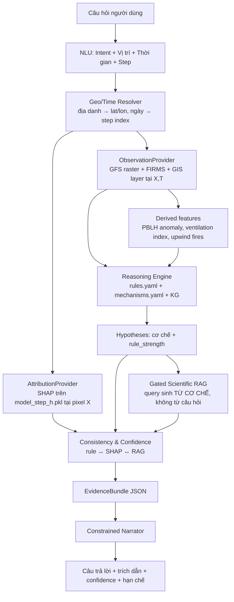

# 01 — Kiến trúc hệ thống

## 1. Nguyên tắc thiết kế

| # | Nguyên tắc | Hệ quả kỹ thuật |
|---|---|---|
| P1 | LLM không bao giờ là nguồn của nguyên nhân | Narrator nhận `EvidenceBundle`, prompt cấm suy đoán |
| P2 | Mọi tuyên bố truy vết được | Mỗi câu gắn `evidence_id`; bundle mang đủ id |
| P3 | Fail-safe | Thiếu bằng chứng → `INSUFFICIENT_EVIDENCE`, không bịa |
| P4 | Modular để ablation | Mỗi tầng bật/tắt được bằng flag → chạy cấu hình A–E |
| P5 | Tri thức tách khỏi code | Ngưỡng & cơ chế nằm trong `knowledge/*.yaml` |
| P6 | Nguồn ngoài đi qua interface | Provider Pattern → thay mock bằng lab không sửa lõi |

---

## 2. Pipeline



**Điểm khác biệt so với RAG thường** (in đậm ở sơ đồ): câu truy vấn vector DB **không phải câu
hỏi của người dùng**, mà là từ khóa khoa học sinh ra từ cơ chế đã được rule kích hoạt. Người dùng
hỏi *"sao hôm nay bụi thế?"* → hệ thống truy vấn *"planetary boundary layer height PM2.5
accumulation urban"*. Đây là **gated retrieval**.

---

## 3. Ranh giới module (quan trọng khi code)

```
                 ┌──────────────────────────────────────────┐
   Thế giới      │  data/     ObservationProvider           │  ← rasterio, xarray, requests
   bên ngoài     │  xai/      AttributionProvider           │  ← xgboost, shap, joblib
                 └──────────────────┬───────────────────────┘
                                    │ chỉ truyền Pydantic schemas
                 ┌──────────────────▼───────────────────────┐
   Lõi thuần     │  reasoning/  rules, kg, hypotheses,      │  ← chỉ numpy, networkx, yaml
   (dễ test)     │              confidence                  │
                 └──────────────────┬───────────────────────┘
                                    │
                 ┌──────────────────▼───────────────────────┐
   I/O phụ trợ   │  rag/       Qdrant, embedding, rerank    │
                 │  narrator/  LLM client                   │
                 └──────────────────────────────────────────┘
```

**Quy tắc cứng**: `reasoning/` không được `import` bất cứ thứ gì thuộc `xgboost`, `shap`,
`rasterio`, `qdrant_client`, `anthropic`. Nếu vi phạm → toàn bộ unit test cần data lab mới chạy
được, và đó là con đường ngắn nhất tới việc không kịp deadline.

---

## 4. Microservice hay Modular Monolith?

| Tiêu chí | Microservice | **Modular Monolith (chọn)** |
|---|---|---|
| Phù hợp khóa luận | Quá tải vận hành (K8s, service mesh) | ✅ Đủ tách để ablation |
| Bật/tắt component | Tốt | ✅ Tốt, qua flag trong `PipelineConfig` |
| Chi phí DevOps | 4–6 tuần | ~0 |

**Quyết định**: FastAPI, mỗi năng lực là một package Python riêng với interface rõ ràng.
Docker Compose chỉ chạy `qdrant` (và `postgis` nếu cần layer GIS sau này). API chạy trực tiếp.

---

## 5. Bản đồ công nghệ

| Thành phần | Công nghệ | Trạng thái |
|---|---|---|
| NLU / Intent | LLM function calling, fallback regex + dateparser | ⬜ |
| Geo/Time Resolver | Bảng địa danh tĩnh (Hà Nội + quận), Nominatim tùy chọn | ⬜ |
| Observation Service | `rasterio`/`xarray` đọc raster GFS của lab tại pixel | ⬜ chờ lab |
| Attribution Service | `shap.TreeExplainer` trên 10 checkpoint XGBoost | ⬜ chờ lab |
| Reasoning Engine | YAML rules + `networkx` KG | ✅ |
| Scientific RAG | Qdrant + BGE-M3 embedding + bge-reranker | ✅ khung |
| Confidence | Logic tổng hợp có trọng số, hiệu chỉnh sau | ✅ |
| Narrator | Claude API (`claude-sonnet-5`) + dryrun template | ✅ |

---

## 6. Cấu hình ablation

Toàn bộ chương đánh giá chạy được bằng cách bật/tắt cờ trong `PipelineConfig`:

| Cấu hình | `use_observation` | `use_shap` | `use_rules` | `use_rag` |
|---|:---:|:---:|:---:|:---:|
| A. LLM-only (baseline) | ✗ | ✗ | ✗ | ✗ |
| B. + Data | ✓ | ✗ | ✗ | ✗ |
| C. + SHAP | ✓ | ✓ | ✗ | ✗ |
| D. + Rule/KG | ✓ | ✓ | ✓ | ✗ |
| E. Full EG-XAQ | ✓ | ✓ | ✓ | ✓ |

Kỳ vọng: hallucination giảm và faithfulness tăng đơn điệu từ A → E. Đây chính là bằng chứng
định lượng cho đóng góp của kiến trúc, nên **các cờ này phải tồn tại từ ngày đầu**, không phải
gắn thêm lúc sắp bảo vệ.

---

## 7. Luồng dữ liệu qua các schema

```
QuestionContext(lat, lon, date, step, raw_question)
        │
        ├─► ObservationProvider ──► Observation(pm25_pred, blh_m, wind_speed_ms, ...)
        │                              │
        │                              └─► DerivedFeatures(blh_anomaly_pct, ventilation_index, ...)
        │
        └─► AttributionProvider ──► Attribution(step, base_value, contributions: list[FeatureContribution])

Observation + Derived ──► RuleEngine ──► list[RuleFiring(rule_id, strength, evidence)]
RuleFiring            ──► KG          ──► list[Hypothesis(mechanism, rule_strength, ...)]
Hypothesis + Attribution ─► Consistency ─► Hypothesis(shap_agreement, verdict)
Hypothesis            ──► GatedRetriever ► Hypothesis(citations: list[Citation], rag_support)
Hypothesis            ──► Scorer      ──► Hypothesis(score, confidence)
                                        │
                                        └─► EvidenceBundle ──► Narrator ──► Answer
```

Chi tiết từng schema: `src/egxaq/schemas.py`.
