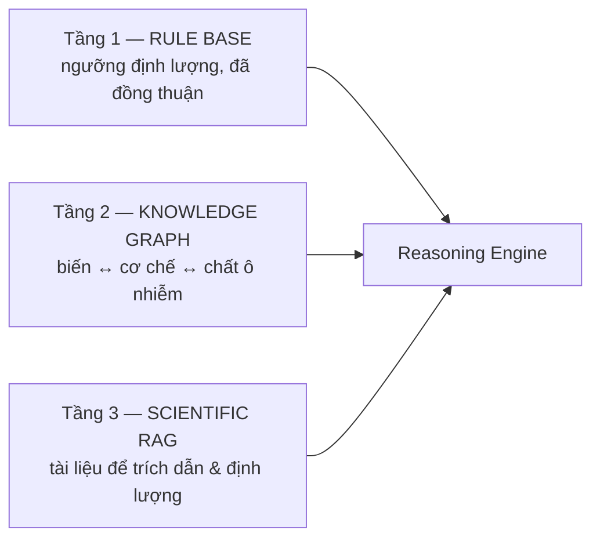

# 03 — Thiết kế Knowledge Base

> File liên quan: `knowledge/rules.yaml`, `knowledge/mechanisms.yaml`,
> `knowledge/feature_map.yaml`, `src/kb.py`, `src/reasoning/kg.py`

## 1. Ba tầng tri thức và ranh giới giữa chúng



Ranh giới quyết định bởi một câu hỏi: **tri thức này có ổn định và có ngưỡng số không?**

| Loại tri thức | Ở đâu | Ví dụ |
|---|---|---|
| Đã đồng thuận rộng, có ngưỡng số, ổn định | **Rule Base** | "PBLH < 500 m → tích tụ" |
| Quan hệ giữa biến, cơ chế, chất ô nhiễm | **Knowledge Graph** | "gió NE → vận chuyển từ thượng nguồn → PM2.5 tăng" |
| Ngưỡng theo vùng, cơ chế thứ cấp, tỉ lệ đóng góp nguồn | **RAG** | "đốt rơm rạ đóng góp bao nhiêu % PM2.5 ở Hà Nội?" |

Rule Base nhanh, minh bạch, dễ kiểm chứng — nhưng cứng nhắc. RAG mềm dẻo và trích
dẫn được — nhưng không biết gì về (X, T). Ghép lại thì bù được cho nhau.

---

## 2. Rule Base

### 2.1. Hàm rule_strength

Mỗi rule là một **hàm dốc tuyến tính** giữa hai điểm:

```
direction: below                        direction: above
strength                                strength
1.0 ┤   ▄▄▄▄▄▄▄                         1.0 ┤        ▄▄▄▄▄▄▄
    │  ╱                                    │       ╱
0.0 ┤▄▄╱                                0.0 ┤▄▄▄▄▄▄╱
    └──┬────┬──────► giá trị                └──────┬────┬───► giá trị
   saturation threshold                      threshold saturation
```

- `threshold` = điểm **bắt đầu** kích hoạt (strength = 0)
- `saturation` = điểm cơ chế đã **rõ ràng** (strength = 1)

**Vì sao tuyến tính chứ không phải sigmoid?** Hai lý do:
1. Chỉ có 2 tham số, và **cả hai đều có ý nghĩa vật lý giải thích được** trước hội đồng.
   Sigmoid có thêm tham số độ dốc mà không ai bảo vệ được giá trị của nó.
2. Không tạo ảo giác về độ chính xác mà dữ liệu không hỗ trợ.

### 2.2. Danh mục rule hiện tại

| ID | Tên | Biến | Hướng | Ngưỡng → bão hòa |
|---|---|---|---|---|
| R1 | Lớp xáo trộn thấp | `blh_m` | below | 500 → 200 m |
| R2 | Tù đọng khí quyển | `wind_speed_ms` | below | 1.5 → 0.3 m/s |
| R3 | Nghịch nhiệt | `lapse_rate_c_per_km` | below | 2.0 → −2.0 °C/km |
| R4 | Rửa trôi ướt | `precip_mm` | above | 1.0 → 10.0 mm |
| R5 | Độ ẩm cao | `rh_pct` | above | 80 → 95 % |
| R6 | Cháy thượng nguồn gió | `upwind_fire_count` | above | 5 → 60 điểm |
| R7 | Thông gió kém | `ventilation_index_m2s` | below | 4000 → 1000 m²/s |
| R8 | Thông gió tốt | `ventilation_index_m2s` | above | 6000 → 20000 m²/s |
| R9 | Bình lưu mạnh | `wind_speed_ms` | above | 4.0 → 8.0 m/s |
| R10 | Tù đọng nhiều ngày | `stagnation_days` | above | 1 → 4 ngày |
| R11 | Cao áp / chìm lún | `mslp_hpa` | above | 1020 → 1032 hPa |
| R12 | Gió từ hướng nguồn | `source_sector_alignment` | above | 0.3 → 0.9 |
| R13 | Chuỗi ngày khô | `precip_sum_3d_mm` | below | 1.0 → 0.0 mm |

**Mỗi rule bắt buộc có `rationale` và `source`** — có unit test kiểm điều này
(`tests/test_kb.py::test_every_threshold_documents_its_source`). Lý do: câu hỏi
chắc chắn nhất từ hội đồng là *"con số này ở đâu ra?"*, và câu trả lời phải chỉ
được vào một chỗ duy nhất.

### 2.3. Vì sao có cả R7 và R8 (ventilation index)

R1 đơn lẻ báo động sai trong một trường hợp thật: PBLH thấp nhưng gió mạnh. Khi đó
khí quyển vẫn phát tán tốt theo phương ngang. Ventilation Index = PBLH × gió gộp cả
hai chiều khuếch tán vào một số, xử lý đúng trường hợp này.

R8 tồn tại vì hệ thống phải trả lời được cả câu **"vì sao hôm nay trời trong lành?"**.
Một hệ thống chỉ giải thích được ngày bẩn thì mới làm nửa bài toán — và bộ đánh giá
có hẳn 10 ngày trong lành (docs/06 §2).

### 2.4. Ngưỡng hiện tại CHƯA hiệu chỉnh

`rules.yaml` có cờ `calibrated: false`. Ngưỡng đang là **ngưỡng văn liệu**, phần lớn
rút từ nghiên cứu dùng ERA5 hoặc quan trắc ở nơi khác. Mô hình của lab dùng **GFS** —
nguồn dự báo, bias khác.

Khi có mẫu dữ liệu huấn luyện (M8 trong data contract):

```powershell
python scripts/calibrate_thresholds.py --csv data/raw/lab_training_sample.csv
```

Script in đề xuất ngưỡng theo **phân vị** của chính phân phối GFS Hà Nội. Ngưỡng phân
vị vừa đúng thống kê vừa dễ bảo vệ: *"PBLH thấp = 15% thấp nhất của mùa đông Hà Nội
theo GFS 2020–2024"* thuyết phục hơn nhiều so với một con số mượn từ bài báo về Bắc Kinh.

Script **chỉ in đề xuất, không tự sửa YAML** — thay đổi tri thức phải do người quyết
định và phải giải thích được.

---

## 3. Mechanisms (nút của Knowledge Graph)

### 3.1. Cấu trúc

```yaml
- id: MECH_LOW_PBLH
  name: "Tích tụ do lớp xáo trộn thấp"
  category: accumulation           # accumulation | transport | formation | removal | enabling_condition
  effect: increase                 # increase | decrease
  triggers: { mode: all, rules: [R1] }
  co_triggers: [R2, R11, R10]
  variables:
    blh: { expected_shap: positive }   # ← cốt lõi của consistency check
  confidence_prior: 0.90
  rag_query: >
    planetary boundary layer height shallow mixing layer PM2.5 accumulation urban haze
  explanation_template: >
    Lớp xáo trộn khí quyển chỉ dày khoảng {blh_m:.0f} m, ...
  limitations: >
    PBLH từ mô hình dự báo có sai số đáng kể so với quan trắc lidar/radiosonde.
```

### 3.2. Gộp rule thành cơ chế

```
mode: all  →  primary = MIN(strength của các rule chính)   # yếu nhất quyết định
mode: any  →  primary = MAX(strength của các rule chính)

rule_strength = min(1, primary × (1 + 0.25 × co))
```

**Dạng NHÂN chứ không phải CỘNG.** Đây là ràng buộc thiết kế: co-trigger *củng cố*
một cơ chế nhưng **không tự tạo ra nó từ con số 0**. Với dạng cộng, một cơ chế có
thể được "sinh ra" bởi các điều kiện phụ trong khi điều kiện chính của nó chưa hề
thỏa mãn — sai về logic nhân quả.
Có unit test: `test_co_triggers_cannot_create_a_mechanism_from_nothing`.

### 3.3. `expected_shap` — trường quan trọng nhất

Đây là chỗ mã hóa **chiều vật lý** mà cơ chế kỳ vọng ở attribution:

| Cơ chế | Biến | expected_shap | Ý nghĩa |
|---|---|---|---|
| Tích tụ PBLH thấp | `blh` | positive | PBLH thấp thì SHAP của nó phải ĐẨY PM2.5 lên |
| Rửa trôi | `precip` | negative | Mưa thì SHAP của mưa phải KÉO PM2.5 xuống |
| Vận chuyển khói | `wind_dir` | any | Hướng gió không có chiều "tốt/xấu" cố định |

Đặt sai dấu ở đây làm hỏng toàn bộ đóng góp nghiên cứu số 2 — consistency check sẽ
báo CONFIRMED khi thực ra là CONFLICT và ngược lại.

### 3.4. Danh mục cơ chế

| Nhóm | Cơ chế | Effect |
|---|---|---|
| Tích tụ | LOW_PBLH, STAGNATION, INVERSION, POOR_VENTILATION, MULTIDAY_ACCUMULATION, ANTICYCLONIC | ↑ |
| Vận chuyển | BIOMASS_TRANSPORT, SOURCE_SECTOR_TRANSPORT | ↑ |
| Hình thành | SECONDARY_AEROSOL | ↑ |
| Loại bỏ | WET_DEPOSITION, ADVECTION_CLEANSING | ↓ |
| Điều kiện cho phép | NO_WET_REMOVAL | ↑ |

`enabling_condition` là một nhóm riêng có chủ đích. "Không mưa" **không gây** ô nhiễm;
nó chỉ khiến ô nhiễm **không được làm sạch**. Prompt của narrator có quy tắc riêng
bắt buộc diễn đạt đúng sắc thái này (docs/07 §2 quy tắc 7).

---

## 4. Knowledge Graph

KG cố ý **nhẹ**: `networkx.DiGraph` dựng từ chính hai file YAML, không ontology đồ sộ,
không Neo4j. Nó làm ba việc:

**Truy vết** — mỗi cạnh gắn với `rule_id` và/hoặc citation:
```
(Variable:blh) -[EVALUATED_BY]-> (Rule:R1) -[TRIGGERS]-> (Mechanism:MECH_LOW_PBLH)
(Mechanism:MECH_LOW_PBLH) -[INCREASES]-> (Pollutant:PM2.5)
(Mechanism:MECH_LOW_PBLH) -[SUPPORTED_BY]-> (Paper:10.xxxx)     ← RAG thêm động
```

**Suy luận nhiều bước** — `explain_path()` trả về toàn bộ chuỗi cạnh, để giao diện
hiển thị dấu vết cho người dùng bấm xem thay vì phải tin lời LLM.

**Sinh hình cho khóa luận** — `to_mermaid()` xuất sơ đồ dán thẳng vào báo cáo:

```powershell
python scripts/demo_explain.py --episode winter_inversion --mermaid
```

---

## 5. `feature_map.yaml` — cầu nối tới mô hình lab

Vấn đề: `mechanisms.yaml` nói về biến `blh`; mô hình lab đặt tên `blh_min_2d`,
`hpbl`, hay `HPBL_surface_min_48h`. Consistency check cần biết đặc trưng nào thuộc
cơ chế nào.

```yaml
canonical_variables:
  blh:
    exact: [blh, pblh, hpbl, blh_m, boundary_layer_height]
    prefixes: [blh_, pblh_, hpbl_]
```

Khớp theo thứ tự: **exact trước, prefix sau**, không phân biệt hoa thường.

### Nhóm `non_mechanistic` — và vì sao nó là kết quả nghiên cứu

```yaml
non_mechanistic:
  exact: [lat, lon, elevation, landuse, population, doy, month, sin_doy, ...]
  prefixes: [lc_, landuse_, static_, geo_, doy_, month_]
```

Đây là những đặc trưng **dự báo tốt mà không giải thích được gì về nhân quả**. Mô hình
của lab chạy per-pixel trên toàn raster, nên rủi ro này rất cụ thể: nó dễ học "pixel
này vốn bẩn hơn pixel kia" hoặc "tháng 1 thì bẩn" thay vì học cơ chế khí tượng.

Hệ thống **không coi đây là lỗi cần giấu**. `Attribution.non_mechanistic_share()` đo
tỉ lệ này, và nếu vượt 30% thì sinh cảnh báo. Kết quả *"X% attribution của mô hình
đến từ biến không mang cơ chế vật lý"* là một phát hiện có giá trị cho khóa luận.

> ⚠ **Việc đầu tiên khi nhận danh sách đặc trưng thật từ lab là cập nhật file này.**
> Không cập nhật → `shap_agreement` luôn bằng 0 → consistency check vô hiệu.

---

## 6. Xác thực lúc nạp (fail fast)

`src/kb.py::_validate()` từ chối nạp nếu:

- Cơ chế tham chiếu rule không tồn tại (sai chính tả → cơ chế **im lặng không bao giờ
  kích hoạt**, loại lỗi khó phát hiện nhất qua đầu ra).
- Cơ chế không có trigger rule nào.
- Cơ chế tham chiếu biến không có trong `feature_map`.
- Cơ chế thiếu `rag_query`.
- Rule mồ côi (không cơ chế nào dùng).

Fail fast ở đây quan trọng vì mọi lỗi trên đều **không gây exception lúc chạy** — chúng
chỉ làm câu trả lời thiếu đi một cơ chế, mà không ai biết.
