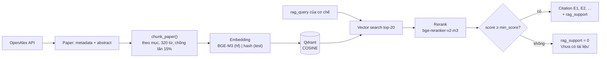

# 05 — Scientific RAG

> File liên quan: `src/rag/` (`corpus.py`, `chunking.py`, `embedding.py`, `store.py`,
> `rerank.py`, `retrieve.py`), `scripts/build_corpus.py`, `scripts/index_corpus.py`

## 1. Bản quyền — đọc trước khi làm bất cứ gì

| Loại tài liệu | Được lưu gì |
|---|---|
| Có **giấy phép mở tường minh** (`cc-*`, `cc0`, `public-domain`) | Metadata + abstract + **full-text** |
| OA nhưng không có giấy phép mở (`bronze`, `publisher-specific-oa`, `other-oa`) | Metadata + **abstract only** |
| Đóng | Metadata + **abstract only** |
| Google Scholar, ResearchGate, HTML nhà xuất bản | ❌ Không cào. Toàn bộ corpus lấy qua API công khai |

**Bẫy quan trọng nhất: `is_oa = true` không có nghĩa là được phép lưu.** OpenAlex đánh
dấu cả *bronze OA* là OA — bài đọc miễn phí trên web nhà xuất bản nhưng không kèm giấy
phép mở nào. Sao chép toàn văn vẫn là vi phạm bản quyền. Trong một lần chạy thử 414 bài:
359 bài có cờ OA nhưng chỉ 282 bài được phép lưu toàn văn (40 bài bronze).

Ràng buộc này được **thực thi bằng code**, điều kiện là giấy phép chứ không phải cờ OA:

```python
# src/rag/models.py
def may_store_full_text(self) -> bool:
    return is_redistributable(self.license)   # thiếu giấy phép → KHÔNG

@model_validator(mode="after")
def validate_licensing(self) -> Paper:
    if self.full_text and not self.may_store_full_text():
        raise ValueError("... bronze OA KHÔNG đồng nghĩa được phép lưu lại ...")
```

Unit test: `test_closed_access_paper_cannot_hold_full_text`,
`test_bronze_oa_is_readable_but_not_storable`, `test_license_gate`.

Mỗi lần xây corpus, `licensing_report()` in bảng phân bố giấy phép — đưa thẳng vào phụ lục.

Nêu rõ điều này trong chương phương pháp của khóa luận — nó bảo vệ tính hợp lệ của
toàn bộ công trình.

---

## 2. Điểm khác biệt cốt lõi: Gated Retrieval

**RAG thông thường:**
```
câu hỏi người dùng  →  vector search  →  đưa cho LLM
```

**EG-XAQ:**
```
câu hỏi người dùng  →  dữ liệu quan sát tại (X,T)  →  rule kích hoạt cơ chế
                    →  rag_query CỦA CƠ CHẾ  →  vector search  →  cổng chặn
                    →  trích dẫn gắn vào ĐÚNG cơ chế đó
```

Ví dụ cụ thể:

| | |
|---|---|
| Người dùng gõ | *"sao hôm nay bụi thế?"* |
| Hệ thống truy vấn vector DB | `planetary boundary layer height shallow mixing layer PM2.5 accumulation urban haze episode` |

### Ba hệ quả

1. **Truy vấn bằng ngôn ngữ khoa học, không phải ngôn ngữ người dùng.** Corpus là
   tiếng Anh học thuật; truy vấn bằng câu hỏi đời thường tiếng Việt sẽ khớp rất kém.
   Đây không phải mẹo kỹ thuật — nó là hệ quả trực tiếp của kiến trúc.

2. **Trích dẫn gắn vào cơ chế, không gắn vào câu trả lời nói chung.** Narrator biết
   chính xác câu nào được chứng minh bởi tài liệu nào → trích dẫn ở **cấp câu**.

3. **Cổng chặn (gate).** Không tài liệu nào vượt `min_score` → `rag_support = 0` và
   cơ chế bị đánh dấu thiếu căn cứ. Đây là INV-3: thà nói *"chưa có tài liệu trong kho
   hỗ trợ cơ chế này"* còn hơn trích dẫn một bài không liên quan.

---

## 3. Pipeline



---

## 4. Xây corpus

### Nguồn: OpenAlex

Vì sao OpenAlex chứ không phải Semantic Scholar hay Google Scholar:

| Nguồn | Đánh giá |
|---|---|
| **OpenAlex** | API mở, không hạn ngạch ngặt, chỉ cần email vào polite pool, có `is_oa` |
| Semantic Scholar | Tốt, nhưng cần key và hạn ngạch chặt hơn |
| Crossref | Metadata chuẩn nhưng không có abstract |
| Google Scholar | ❌ Không có API chính thức |

**Abstract dạng inverted index.** OpenAlex trả abstract dưới dạng
`{"Low": [0], "boundary": [1], ...}` để lách bản quyền. `_reconstruct_abstract()`
dựng lại thành văn xuôi.

### Truy vấn = chính `rag_query` của các cơ chế

```powershell
python scripts/build_corpus.py --per-query 20
```

Script lấy `rag_query` của **từng cơ chế** trong `mechanisms.yaml`, cộng thêm 7 truy
vấn nền (Hà Nội, đồng bằng sông Hồng, ĐNÁ, PMF, SHAP cho AQ, gió mùa ĐB, haze Đông Á).

Nhờ vậy corpus được xây **đúng theo nhu cầu của reasoning engine**, không phải một
đống tài liệu chung chung. Bài xuất hiện ở nhiều truy vấn được gộp `query_tags` — chỉ
số hữu ích: bài phục vụ nhiều cơ chế thường là tổng quan tốt, đáng đọc kỹ.

### Snowball theo danh mục tham khảo

```powershell
python scripts/build_corpus.py --per-query 30 --snowball --snowball-seeds 30
```

Tìm theo từ khóa có trần: đổi cách diễn đạt vẫn ra gần đúng tập bài cũ. Danh mục tham
khảo đi theo cấu trúc thật của tài liệu — phương pháp chuẩn trong systematic review.
OpenAlex cho OR 50 ID mỗi request nên 500 tài liệu tham khảo chỉ tốn 10 request.

Tham khảo kéo về nhiều bài lạc đề (một bài haze Bắc Kinh trích cả bài về mùa đông hạt
nhân), nên ứng viên phải qua **cổng lọc**: năm, số trích dẫn, và từ khóa miền
(`DOMAIN_KEYWORDS`). Chạy thử: 8 bài hạt giống → 2259 ứng viên → giữ 284.

### Độ phủ địa lý — đã đo

```powershell
python scripts/corpus_coverage.py --by-mechanism
```

Corpus hiện tại (1025 bài): Đông Á 31%, châu Âu 14%, Bắc Mỹ 7%, Nam Á 5%,
**Việt Nam 3% + ĐNÁ khác 5% = 8%**, không rõ/tổng quát 36%.

Không làm hỏng tầng RAG: trích dẫn chống lưng **cơ chế vật lý**, và lớp xáo trộn nông giữ
bụi ở Bắc Kinh hay Hà Nội theo cùng một cơ chế. Nhưng ngưỡng, cơ cấu nguồn thải và chế
độ khí hậu thì phụ thuộc địa phương — con số 8% phải nêu trong chương hạn chế.

### Dogfooding

Sau khi RAG chạy, dùng chính nó để dựng và kiểm chứng danh mục tài liệu tham khảo của
khóa luận. Vừa tiện vừa là một minh chứng đẹp trong báo cáo.

---

## 5. Chunking

**Chiến lược: theo cấu trúc trước, theo độ dài sau.**

Vì sao không cắt cứng theo số token: một câu khẳng định cơ chế —
*"PBLH below 500 m was associated with a 2.3-fold increase in PM2.5"* — bị cắt đôi
thì đoạn nào cũng mất nghĩa, và **trích dẫn sẽ không chứng minh được điều nó nói**.

| Tham số | Giá trị | Ghi chú |
|---|---|---|
| Nhận diện mục | regex Abstract/Introduction/Methods/Results/Discussion/Conclusion | không nhận ra → một mục `body` |
| Kích thước | 320 từ ≈ 400–450 token | |
| Chồng lấn | 15%, tính theo **câu nguyên vẹn** | một ý trải qua ranh giới vẫn còn ngữ cảnh |
| Ranh giới | **không bao giờ cắt giữa câu** | có unit test |
| Tiêu đề bài | ghép vào đầu mỗi chunk | embedding của một đoạn Methods rời rạc rất dễ lạc chủ đề |

**Với bài chỉ có abstract** (đa số, do ràng buộc bản quyền): một abstract thường vừa
gọn trong 1–2 chunk. Đây không phải hạn chế nghiêm trọng như thoạt nghe — abstract
vốn là phần **đậm đặc kết luận nhất** của bài báo.

---

## 6. Embedding

| Backend | Model | Dùng khi nào |
|---|---|---|
| `hf` | `BAAI/bge-m3` | **Mọi kết quả trong khóa luận.** Đa ngôn ngữ → xử lý được cả tài liệu tiếng Việt |
| `precomputed` | vector BGE-M3 tính sẵn | **Máy local khi chạy thật.** Tra `data/corpus/query_vectors.json`, không cần torch |
| `hash` | — | **Chỉ unit test.** Băm n-gram, offline, không cần torch |

### Vì sao máy local không cần torch

Gated retrieval biến tập truy vấn thành **tập đóng**: truy vấn là `rag_query` của 12 cơ chế,
không phải câu người dùng gõ. **Câu hỏi người dùng không bao giờ được embed** — nó chỉ xác
định địa điểm và thời gian. Vì vậy 12 vector truy vấn được tính sẵn trên Kaggle cùng lượt
với tài liệu. `PrecomputedQueryEmbedder` ném lỗi khi gặp truy vấn lạ thay vì trả vector
rỗng. Sửa `rag_query` trong YAML thì phải chạy lại notebook.

### Vì sao vẫn giữ backend `hash`

Nếu bắt buộc phải có torch (~2 GB) mới chạy được test, thì test sẽ không chạy trên CI
và trên máy yếu — và trong thực tế là **không ai chạy**. Backend `hash` giữ cho toàn bộ
đường ống RAG luôn được kiểm thử.

Nó **không có chất lượng ngữ nghĩa**: "boundary layer" và "mixing height" sẽ không gần
nhau. `hash_backend_warning()` nhắc điều đó ở mọi nơi cần thiết, và
`scripts/index_corpus.py` in cảnh báo khi phát hiện.

---

## 7. Rerank

Vì sao cần thêm một bước sau vector search: **bi-encoder nén cả đoạn văn vào một
vector trước khi biết truy vấn là gì**. Nó giỏi gọi ra ~20 ứng viên nhưng xếp hạng
chưa sắc. Cross-encoder đọc *đồng thời* truy vấn và đoạn văn, nên phân biệt được:

- "bài này **nhắc tới** boundary layer"
- "bài này **chứng minh** boundary layer thấp làm tăng PM2.5"

Trong hệ thống này **precision quan trọng hơn recall**: một trích dẫn sai làm hỏng
tính "evidence-grounded" nặng hơn là thiếu một trích dẫn đúng.

**Chi tiết dễ bỏ sót**: cross-encoder trả logit, cosine trả [−1, 1]. `_to_unit()` ép
logit qua sigmoid về [0, 1] để **cùng thang** — nếu không, bật/tắt reranker sẽ vô tình
đổi luôn độ chặt của cổng chặn và làm hỏng so sánh ablation.

---

## 8. Vector store

**Qdrant** là backend chính thức. Bản chạy thật nằm trên **Qdrant Cloud** (collection
`egxaq_papers`, 1101 điểm); `docker compose up -d qdrant` là đường lui chạy local. Distance = COSINE vì mọi embedder đều trả vector đã
chuẩn hóa L2.

`InMemoryStore` **chỉ dùng cho test**. Nếu Qdrant không kết nối được, `QdrantStore`
**ném lỗi rõ ràng** chứ không âm thầm chuyển sang bộ nhớ — im lặng thất bại ở tầng
này sẽ tạo ra câu trả lời không có trích dẫn mà không ai biết.

`Chunk.point_id()` sinh UUID xác định từ `chunk_id`, nên index lại cùng một chunk sẽ
**ghi đè** thay vì nhân bản.

---

## 9. Tính `rag_support`

```
support = 0.65 · độ_khớp_tốt_nhất_chuẩn_hóa  +  0.35 · độ_phủ

    độ_khớp = (best_score − min_score) / (1 − min_score)
    độ_phủ  = số_BÀI_khác_nhau_giữ_lại / top_k     ← đếm theo bài, không theo đoạn
```

Hai thành phần vì hai thứ khác nhau đều đáng kể:
- Một tài liệu khớp **rất sát** là bằng chứng mạnh.
- **Nhiều tài liệu độc lập** cùng nói một điều là *đồng thuận khoa học* — thứ mà một
  bài đơn lẻ không thay thế được.

---

## 10. Cấp nhãn bằng chứng

**Một bài báo = một bằng chứng.** Nhãn `E1, E2, ...` định danh một *tài liệu* (theo DOI),
không phải một đoạn. Hai đoạn của cùng một bài chỉ sinh một nhãn; đoạn hiển thị là đoạn
khớp nhất. Nhãn được cấp **toàn cục**: một bài chống lưng hai cơ chế mang cùng nhãn ở cả
hai chỗ.

Nếu cấp theo đoạn: `[E3]` và `[E4]` trỏ về cùng một bài, người đọc tưởng hai bằng chứng
độc lập, và `độ_phủ` bị thổi phồng — đúng thành phần đo đồng thuận khoa học.
Unit test: `test_one_paper_yields_one_citation`, `test_coverage_counts_papers_not_passages`,
`test_evidence_ids_are_shared_across_mechanisms`.

---

## 11. Tham số cấu hình được (đều là biến ablation tiềm năng)

| Tham số | Mặc định | Ghi chú |
|---|---|---|
| `fetch_k` | 20 | Ứng viên lấy trước rerank |
| `top_k` | 3 | Trích dẫn giữ lại mỗi cơ chế — giữ ít để câu trả lời không loãng |
| `min_score` | **0.569** | **Cổng chặn.** Hiệu chỉnh sơ bộ trên corpus thật bằng `calibrate_rag_gate.py`; chỉ đúng với BGE-M3. Còn phải kiểm bằng query có nhãn (docs/06 §3.2) |
| `chunk_words` | 320 | |
| `overlap_ratio` | 0.15 | |

---

## 12. Quy trình vận hành

KB được dựng **trọn gói trên Kaggle** (GPU T4). Máy local chỉ truy vấn.

```powershell
# 1. Đẩy code lên GitHub (notebook clone repo và gọi chính code của repo)
git push

# 2. Kaggle: chạy notebooks/kaggle_build_kb.py
#    Settings: GPU T4 + Internet ON; Add-ons → Secrets: QDRANT_URL, QDRANT_API_KEY
#    Save Version → Save & Run All

# 3. Tải từ tab Output về data/corpus/:  query_vectors.json, papers.jsonl

# 4. .env ở máy local
#    EGXAQ_EMBEDDING_BACKEND=precomputed
#    EGXAQ_QDRANT_URL=https://<cluster>.cloud.qdrant.io:6333
#    EGXAQ_QDRANT_API_KEY=<key>

# 5. Hiệu chỉnh cổng, đo độ phủ, chạy demo
pip install qdrant-client
python scripts/calibrate_rag_gate.py
python scripts/corpus_coverage.py --by-mechanism
python scripts/demo_explain.py --rag qdrant
```

**Tên biến khác nhau ở hai nơi:** Kaggle Secrets không có tiền tố (`QDRANT_URL`), `.env` có
tiền tố (`EGXAQ_QDRANT_URL`). Đừng dán API key vào notebook hay vào chat.

Đường lui không cần mạng: `python scripts/demo_explain.py --rag memory` nạp thẳng
`papers.jsonl` vào RAM (chỉ để demo, không lấy số liệu).
